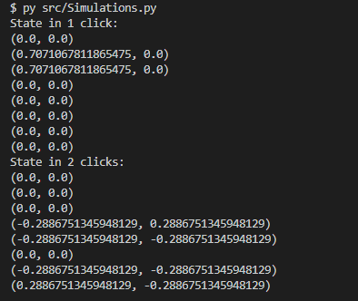

# Double-slit-Experiment

Se realizara la simulacion del experimento de la doble rendija.
Dicho experimento consiste en: 
Apuntar una fuente de electrones o fotones hacia unas rendijas que dispersen su haz de luz, generando un patron inesperado, el cual se explica por medio de la interferenncia de las particulas de luz con sigo mismas en otros universos. 
En este caso para modelar este fenomeno utilizaremos la fisica cuantica, por medio de la libreria que hemos venido desarrollando.  

## Experimento real
Esta imagen representa conceptual mente el montaje real.

Ahora, una vez tengamos el montaje real buscamos obtener lo siguiente.


Dicho esto, nuestro montaje simplemente consistió en colocar una mina frente al laser, que hará las veces de la rendija. Esto se hizo con el objetivo de hacer mas sencillo el montaje. Aparte de esto se monto una pantalla, en la cual se pudiese reflejar los resultados, además se pego el laser a una base para darle estabilidad y en la misma esta unida a la mina(rendija).
De este modo el montaje quedo así:


## Simulación en la libreria
En este caso para confirmar el experimento práctico, se buscaba la realización de una simulación dentro de la librería que hemos estado manejando.
Lo primero que cabe aclarar, es el experimento que se quiere simular, en este caso se uso el siguiente (extraído del libro):


Y ese experimento queda representado dentro del siguiente código.
```python
x=1/(2**0.5) # Esta variable es usada para representar el 1/(2^0.5)

y = 1/(6**0.5) # Variable usada para representar el 1/(6^0.5)
# Matriz que representa al sistema.
double_slit = [
	[(0,0),(0,0),(0,0),(0,0),(0,0),(0,0),(0,0),(0,0)],
	[(x,0),(0,0),(0,0),(0,0),(0,0),(0,0),(0,0),(0,0)],
	[(x,0),(0,0),(0,0),(0,0),(0,0),(0,0),(0,0),(0,0)],
	[(0,0),(-y,y),(0,0),(1,0),(0,0),(0,0),(0,0),(0,0)],
	[(0,0),(-y,-y),(0,0),(0,0),(1,0),(0,0),(0,0),(0,0)],
	[(0,0),(y,-y),(-y,y),(0,0),(0,0),(1,0),(0,0),(0,0)],
	[(0,0),(0,0),(-y,-y),(0,0),(0,0),(0,0),(1,0),(0,0)],
	[(0,0),(0,0),(y,-y),(0,0),(0,0),(0,0),(0,0),(1,0)]
]
# Estado inicial del sistema
initial_state = [
	(1,0),
	(0,0),
	(0,0),
	(0,0),
	(0,0),
	(0,0),
	(0,0),
	(0,0)
]
# Estado luego de un click
state_click_1 = move(double_slit, 1, initial_state)
# Estado luego de dos clicks
state_click_2 = move(double_slit, 2, initial_state)
print("State in 1 click:")
for i in state_click_1:
	print(i)
print("State in 2 clicks:")
for i in state_click_2:
	print(i)
```

Los resultados generados por dicho código, son:



Estos datos son los resultados de evaluar el sistema en dos posiciones. 
La primera seria en un click de tiempo: Esto nos señala que la luz proveniente del nodo origen, se ha transladado a las rendijas dentro del sistema. Para ser más claros, el "Valor" de la probabilidad que inicialmente se encontraba en el nodo , se distribuyo equitativamente en el nodo 1 y 2.
Por otro lado, la segunda tanda de resultados se da una vez el sistema ha alcanzado dos clicks: Estos nos muestra de manera clara el evento de interferencia. Como se puede ver en los nodos que no son objetivo de dos rendijas a la vez, la luz persiste, de una manera u otra los valores de probabilidad siguen existiendo. Mientras que en los nodos que en efecto son foco de dos rendijas al mismo tiempo, la luz se atenua y de hecho se "cancela", por cancelar queremos decir que es en estos casos donde se presenta la interfencia entre las particulas de nuestro universo y las particulas presentes en otros, lo cual causa que la luz que llega a dicho nodo sea "Nula".

## Autores 

- Miguel Armando Guluma Sanchez 
- Jeymar Vega
- Diego Alejandor Corredor Tolosa
